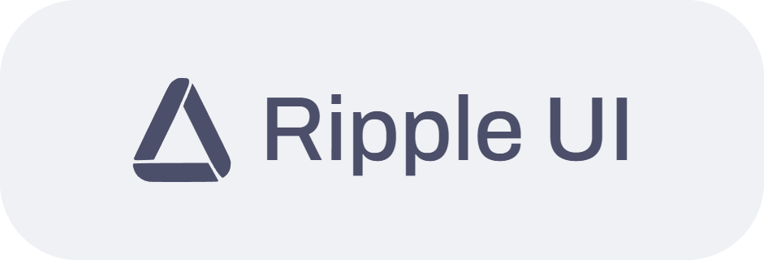

<h1 align="center">
    <a href="https://joubamety.com">joubamety.com</a>
</h1>

    <b><i>Built with</i></b>
    

        
        
    

 

* *Hand-crafted website using [Tailwind CSS](https://tailwindcss.com/) and [Ripple UI](https://www.ripple-ui.com/).*
* Gets my current Discord status via Discord Bot (fittingly named *JoubaMetyAPI*) using [Discord API](https://discord.com/developers/docs/intro), which then serves the status as HTML (using template) via my API (*api.joubamety.com*).
  * Discord Bot is built via [bwmarrin/discordgo](https://github.com/bwmarrin/discordgo) and uses [a-h/templ](https://github.com/a-h/templ) for HTML template.
  * Since I haven't found any way to get game art from Discord via Discord API, I'm using [IGDB API](https://www.igdb.com/api) to get game art.
  * *Might* publish the source code for that after I clean up the mess.
* Using color palettes/schemes for themes such as [Catppuccin](https://github.com/catppuccin/catppuccin), [Nord](https://github.com/nordtheme/nord), [Tango](https://en.wikipedia.org/wiki/Tango_Desktop_Project), [gruvbox](https://github.com/morhetz/gruvbox) and [Dracula](https://github.com/dracula/dracula-theme).
* Using icons from Tailwind's [heroicons](https://heroicons.com/).
* Using emotes & flags from [Twemoji](https://github.com/jdecked/twemoji)
* Using [SVGOMG](https://svgomg.net/) to optimize SVGs (mainly to reduce complexity), which are used in the website.

 

    

        
    

    

        <b>©️ JoubaMety "Jan Rašnovský", 2024</b>
    

